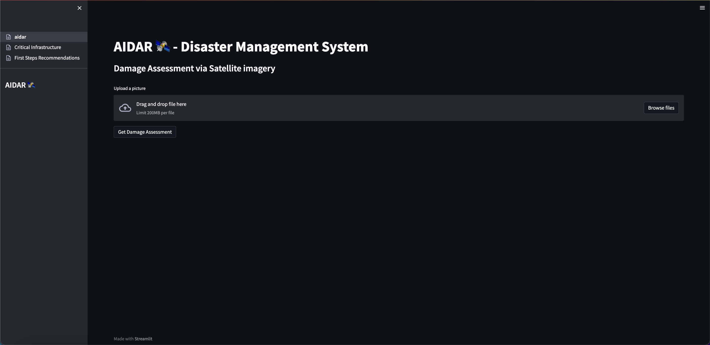
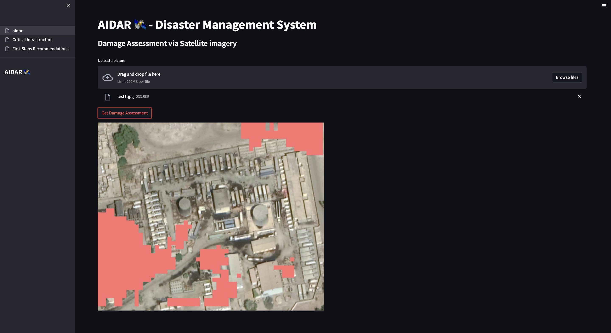
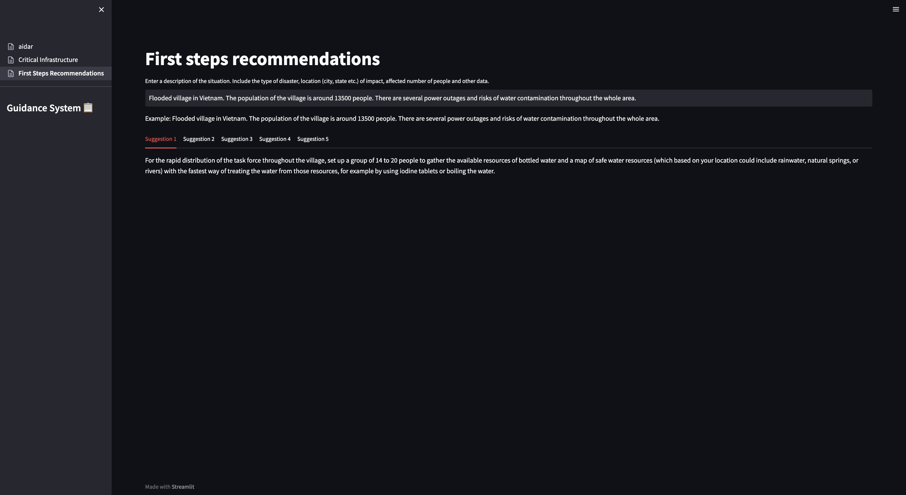

# AIDAR - Disaster Management

As part of the [TUM.ai Makeathon 2022](https://makeathon.tum-ai.com/), we created AIDAR. AIDAR uses state of the art ML to analyze all relevant data sources about large disasters to give response personal the best action recommendations.

The project is divided into a UI and a fastapi server that provides a damage assessment service (see [here](https://github.com/jacob271/AIDAR-Destruction-Detection)).

## Setup and Installation

You need `python3.8` or higher to run the UI.

Install the requirements using `pip install -r requirements.txt`.

In order two use the damage assessment, make sure to start the fastAPI server first. You can instructions on how to do so in [this repository](https://github.com/jacob271/AIDAR-Destruction-Detection).

If you want to try out the recommendations, please provide a openAI API key by setting the corresponding environment variable with
- Linux: `export OPENAI_API_KEY="YOUR_KEY"`
- Windows: `set OPENAI_API_KEY="YOUR_KEY"`

Start the UI with `streamlit run aidar.py`.

## Demo

This is how the UI currently looks like.

### Start Page

### Damage Assessment

### Recommendations

